# Hexapod Robot
For my project, I built a hexapod. The robot has 6 legs which are independenty controlled by servo motors and each leg can move on its own. The hexapod has a wide variety of movement options due to this fact, such as differnt walking gaits and turning in place.

You should comment out all portions of your portfolio that you have not completed yet, as well as any instructions:
```HTML 
<!--- This is an HTML comment in Markdown -->
<!--- Anything between these symbols will not render on the published site -->
```

| **Engineer** | **School** | **Area of Interest** | **Grade** |
|:--:|:--:|:--:|:--:|
| Jiayang D | Lynbrook High School | Mehcanical/Electrical Engineering | Incoming Sophomore |

**Replace the BlueStamp logo below with an image of yourself and your completed project. Follow the guide [here](https://tomcam.github.io/least-github-pages/adding-images-github-pages-site.html) if you need help.**


  
# Final Milestone
<iframe width="560" height="315" src="https://www.youtube.com/embed/RHfodgyZKLk?si=RhUic0zLaz7TaMKA" title="YouTube video player" frameborder="0" allow="accelerometer; autoplay; clipboard-write; encrypted-media; gyroscope; picture-in-picture; web-share" referrerpolicy="strict-origin-when-cross-origin" allowfullscreen></iframe>
For my final milestone, I added a camera to the front of my hexapod, programming it to broadcast live video online.


I chose to use an Arducam OV2640 along with a Raspbery Pi Pico microcontroller in order to process the images captured by the camera. However, due to issues with the compatibility between the Raspberry Pi and the Arducam, I instead decided to switch to an Adafruit Feather v2 Microcontroller instead. 

## Programming default camera functionality
After purchasing the Arducam, I found premade code on the arducam website. However, when testing the code, the camera was able to start but unable to capture images. The issue was caused by an incompatibility in the code, as it was written for an Arduino UNO microcontroller instead of the Feather v2 I was currently using. I changed a few of the pin mappings in the code to prevent the camera from sending signals to the wrong pin, and imported a library to allow the microcontroller use of functions it was missing. These changes fixed the issue, and I was able to take photos with the camera.

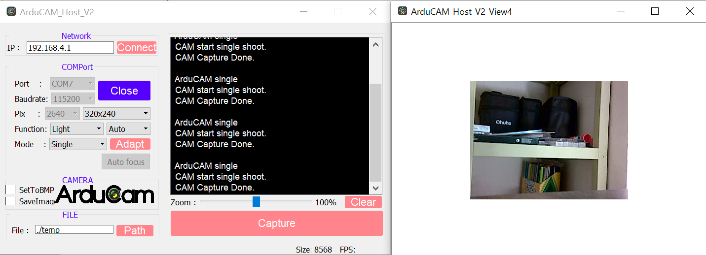{: style="display: block; margin: 0 auto;"} 
<div align="center">
  Taking a photo with Arducam using HostApp
</div>

## Adding wireless camera functionality
Even though the camera could now take images, I was not satisfied with the current functionality. With the current code, the microcontroller had to be plugged into my computer constantly in order to transfer information. I wanted the robot to be able to record remotely, and while moving, so I started work on programming the robot to transmit the information wirelessly. I started by modifying the code to create a wifi connection to a specific IP using the Feather v2's built in wifi transceiver. I then programmed the feather v2 to continually check for a user on the wifi connection, and to send photos taken by the Arducam to the website if a connection was detected. This allowed the camera to stream video, but the video was inconsistent and would frequently crash.

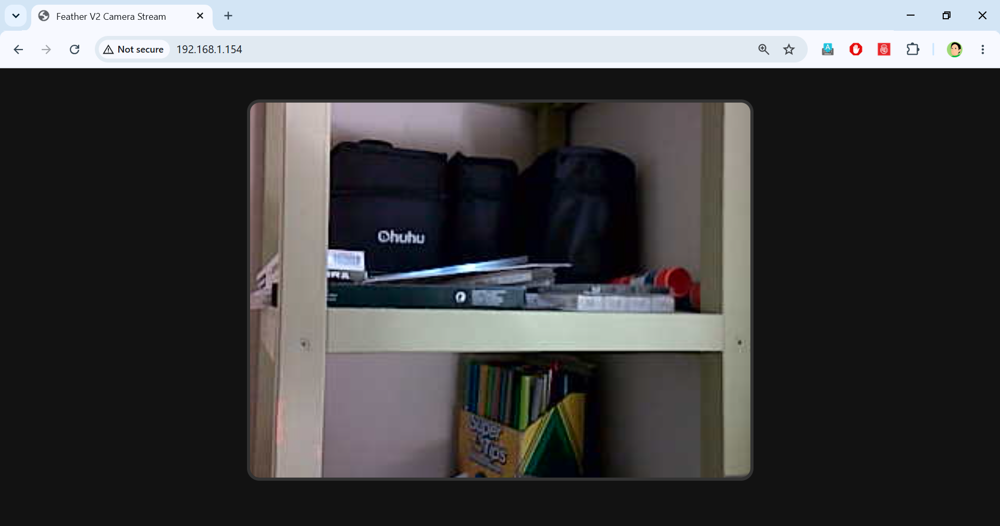{: style="display: block; margin: 0 auto;"} 
<div align="center">
  Video being broadcast to an IP adress
</div>

## Wiring the Arducam and Feather v2
Initially, I tried placing the Feather v2 microcontroller onto a breadboard and inserting male wires into the breadboard to allow for connection to the microcontroller. I used female wires to directly attach to the Arducam's pins. However, I discovered that this connection method caused the signal between the Arducam and the microcontroller to frequently disconnect. Upon further testing, I found the issue to be that the pins were too loose, and in the moments when the pins were not in contact with the board, the signal would disconnect. To resolve this issue, I soldered header pins onto the microcontroller, ensuring that the pins would always be in contact with the microcontroller. This also allowed me to remove the breadboard and reduce the size footprint of the microcontroller. I also soldered male wires to the pins of the Arducam for good measure, guaranteeing that the connection would always remain stable. Also, I connected the Arducam to the 5V power output on the hexapod and I connected the microcontroller to the 3.3V output. This meant that all components on the hexapod could supply energy directly from the battery on the hexapod, allowing it to move around freely detached from my computer while still streaming video to the website. However, even with the changes to the wiring of the camera and microcontroller, the camera was still 


## Improving the wireless camera code
I managed to 


For your final milestone, explain the outcome of your project. Key details to include are:
- What you've accomplished since your previous milestone
- What your biggest challenges and triumphs were at BSE
- A summary of key topics you learned about
- What you hope to learn in the future after everything you've learned at BSE

For my final milestone, I added a camera to hexapod, allowing it to remotely broadcast video of its surrounds to a website. 

# Second Milestone
<iframe width="560" height="315" src="https://www.youtube.com/embed/C8R0I1Gc1Kc?si=Jo8ulrJLg_x0mOOA" title="YouTube video player" frameborder="0" allow="accelerometer; autoplay; clipboard-write; encrypted-media; gyroscope; picture-in-picture; web-share" referrerpolicy="strict-origin-when-cross-origin" allowfullscreen></iframe>
For my second milestone, I used provided Arduino and Processing app to allow the hexapod to move. I also built a remote control for my hexapod and I designed a 3-D printed battery case to allow the hexapod to carry its battery while moving. 

## Programming the robot
Premade code was provided by the company that created the hexabot kit in the form of Processing App and Arduino code files. An option to completely code the robot from scratch was avaiable, but I did not choose to take it. However, the premade code still provided some degree of customization and flexibility. I was able to adjust the robot's movement speed, walking gait (see "How it works" section below), and the radio frequency of communications between the robot and the remote, which I changed to prevent my hexapod from receiving singals from other studennt's controllers. 

## Designing the Battery Case
Before creating the CAD for the battery case,  I created a model of the hexapod's chassis to ensure that the battery holder I designed later would fit correctly onto the hexapod. During the modeling of the hexapod's chassis, I also decided on the points of attatchent for the battery case, choosing them to be as far apart as possible to ensure stability.

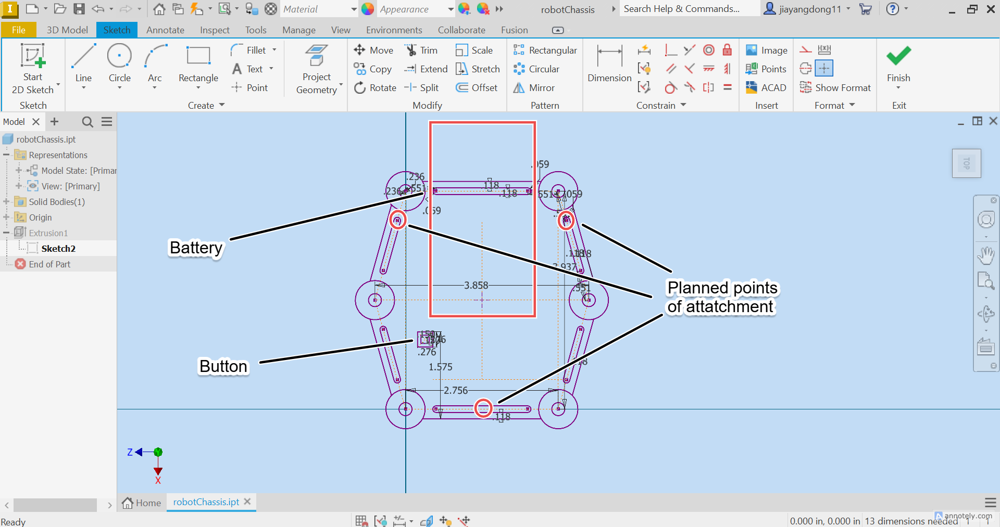{: style="display: block; margin: 0 auto;"}
<div align="center">
  Sketch of hexapod chassis geometry
</div>
<br>
First, I created the baseplate, designing it to be large enough to ensure a comfortable margin betweeen the points of attatchment and the edge of the baseplate. Instead of making a separate extension for each of the points of attatchment, I created a large platform to guarentee that the battery case would be stable and to reduce the risk of breaking under stress. I added stilts to the points of attatchment in order to elevate the battery case from the electrical components also present on top of the hexapod. While doing this, I also discovered that the power button of the hexapod would be covered by the battery case baseplate.

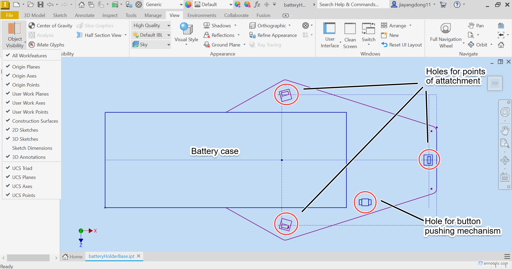{: style="display: block; margin: 0 auto;"}
<div align="center">
  Sketch of hexapod baseplate geometry
</div> 
<br>
Next, I created the individual parts of my 3D model, starting with making 3D models of the battery case baseplate and walls, which I dimensioned according the the size of the battery. After finding that power button of the hexapod would be covered by the baseplate of the battery case, I designed a mechanism to extend the button, allowing the power switch to be pressed from a point above the baseplatee. I created a rectangular rod with two keys on opposing sides. I then designed a casing with grooves matching the keys, allowing the rod to move freely within the casing.

<div align="center">
  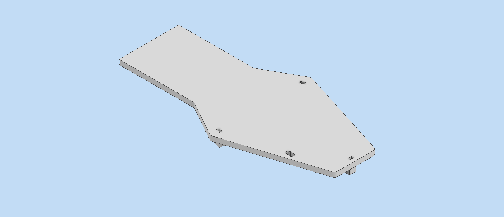 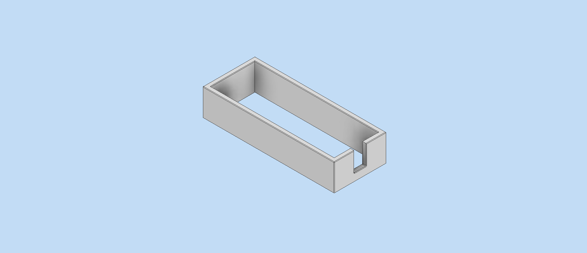
</div>
<div align="center">
  Left: 3D model of battery case baseplate / Right: 3D model of battery case walls
</div> 
<br>
<div align="center">
  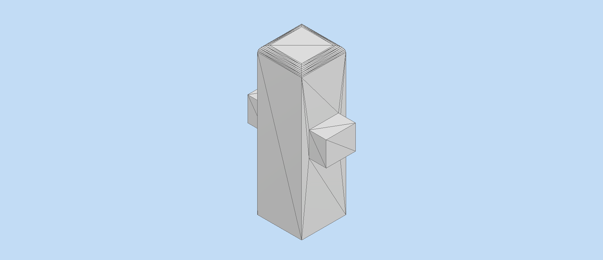 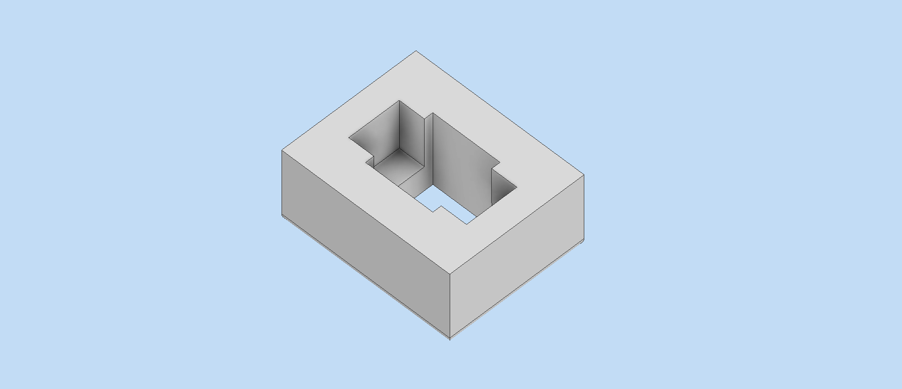
</div>
<div align="center">
  Left: 3D model of button with keys / Right: 3D model of button holder with grooves
</div> 
<br>
I finished the first battery case design by attatching the button holder mechanism to its corresponding hole on the baseplate of the battery case.

{: style="display: block; margin: 0 auto; width: 400px;"}
<div align="center">
  Image of battery case v1
</div>
After 3D printing the first version of my battery case, I found that it did not print well due to the unusual shape. Also, a few measurements were off. The postition of the button pushing mechanism did not align with the power switch on the hexapod, and the length of the button did not account for the height of the stilts, meaning that the that it could not reach the power switch. I split the battery case into two parts attatched by screws to make it easier to print, and fixed the alignments of the battery holder and button. 

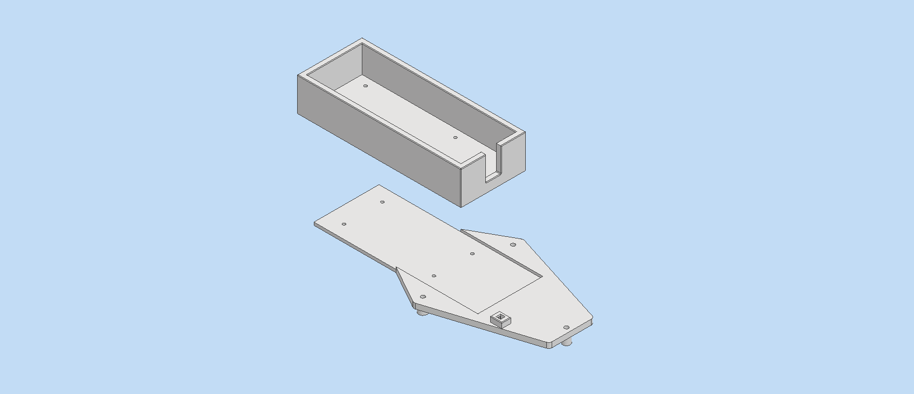{: style="display: block; margin: 0 auto; width: 400px;"}
<div align="center">
  Image of battery case v2
</div>


## How it works
The hexapod moves by utilizing 18 360 degree servo motors, allowing each leg of the hexapod to move independently and with a large range of motion. In each leg, one servo controls the movement along the xy axis, allowing the leg to turn. The two other servos control the movement of the leg segments, allowing the for the extension or contraction of the leg.

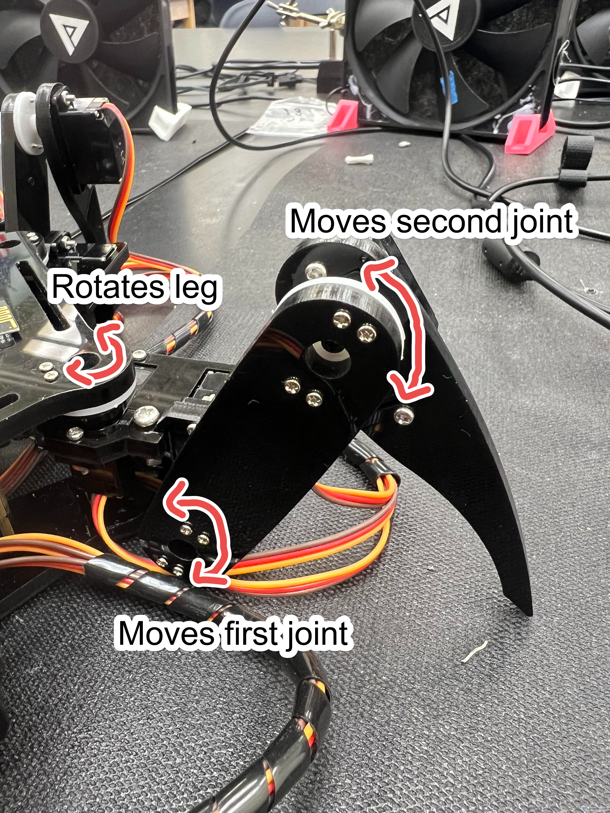{: style="display: block; margin: 0 auto; width: 500px;"}
<div align="center">
  Diagram of hexapod leg movement
</div>
<br>
The premade code from the company that created the hexapod allows for three movement types, or gaits. The Tripod gait is the fastest in terms of movement speed, as the robot moves three non-adjacent legs at a time and completes a movement cycle in only two movements. The Wave gait only moves one leg at a time, sacrificing speed for stability on rough terrain, maintaing five legs on the ground at all times. Finally, there is an intermediate hybrid gait that combines aspects of both, moving one or two legs at a time to balance speed and stability.

<div align="center">
  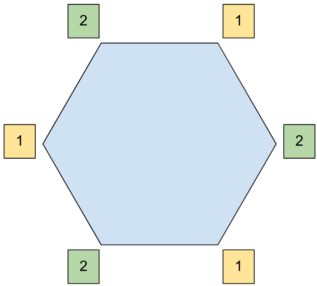 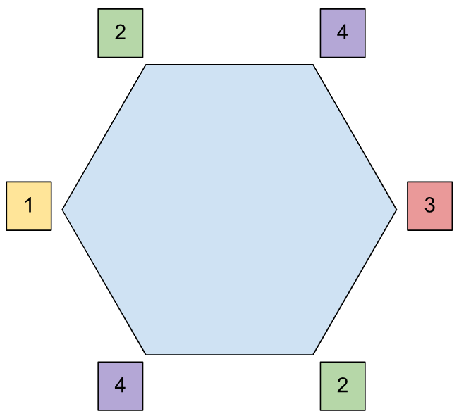 
</div>
<div align="center">
  Left: Tripod gait / Center: Hybrid gait / Right: Wave gait
</div>
<br>

## Next Step
For my next step, I want to mount a camera capable of filming and broadcasting video to the front of the hexapod. I also want to experiment with a raspberry pi in order to program object detection and avoidance.

# First Milestone
<iframe width="560" height="315" src="https://www.youtube.com/embed/IBBULp1QDGs?si=18xh0vsklhWrsrXV" title="YouTube video player" frameborder="0" allow="accelerometer; autoplay; clipboard-write; encrypted-media; gyroscope; picture-in-picture; web-share" referrerpolicy="strict-origin-when-cross-origin" allowfullscreen></iframe>
<br>
For my first milestone, I built the chassis of the hexapod and and finished wiring the electrical components. First, I attatched the 18 servo discs to the acrylic chassis and the legs of the hexapod with self threading screws. The servo discs are used to securely connect the servo motors to the body and legs of the hexapod. After connecting each of the servos to the control board, I soldered connector wires to allow an external battery to power the hexapod. With the addition of an acrylic backboard, the chassis was complete.


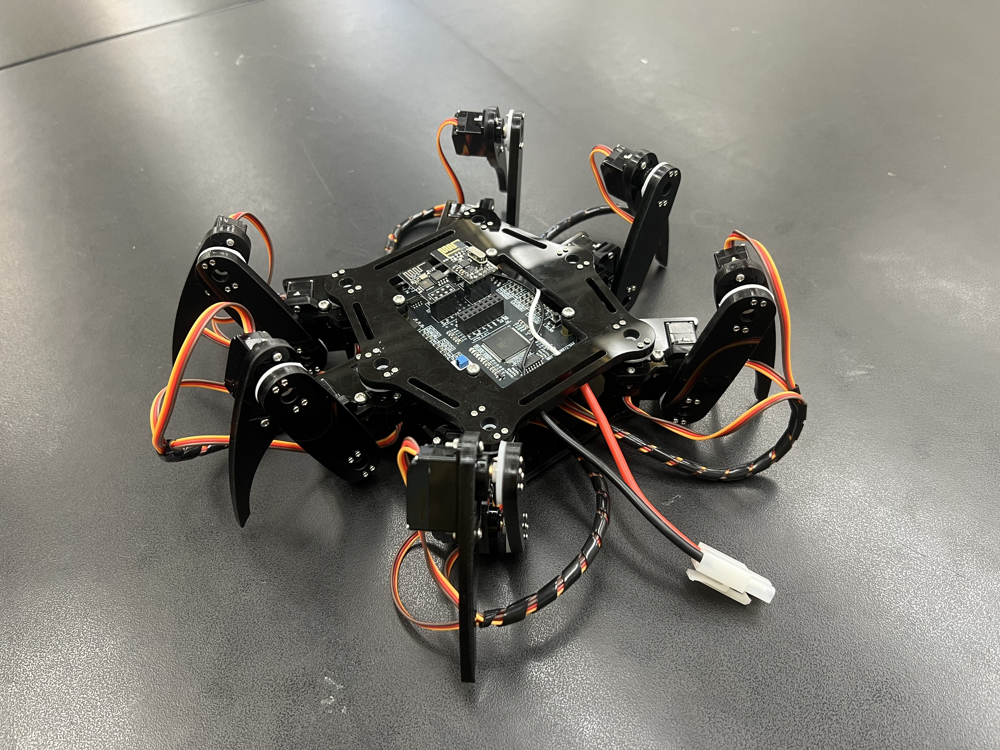{: style="display: block; margin: 0 auto; width: 400px;"} 
<div align="center">
  Hexapod top view
</div>

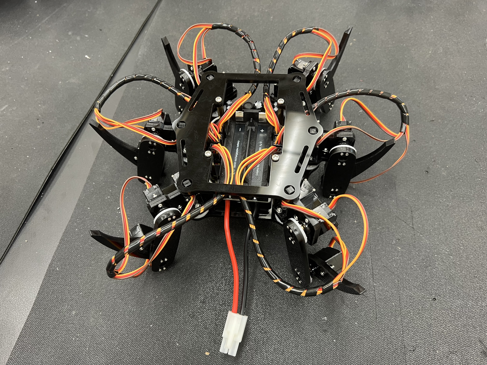{: style="display: block; margin: 0 auto; width: 400px;"}
<div align="center">
  Hexapod bottom view
</div>

## Integrating the battery
Due to the fact that the two 3.7V lithium batteries the hexapod called for were deemed unsafe, I used a 7.2V battery instead to power the hexapod. At first, I thought that soldering a connecter to connect the battery to the power pins on one side of circuit board would be enough, but it became evident after testing the power with a multimeter that I would have to connect the power to the other side of the circuit board as well. After soldering two wires to connect all the circuit board's power pins to the battery, power was sucessfully supplied to the entire robot.

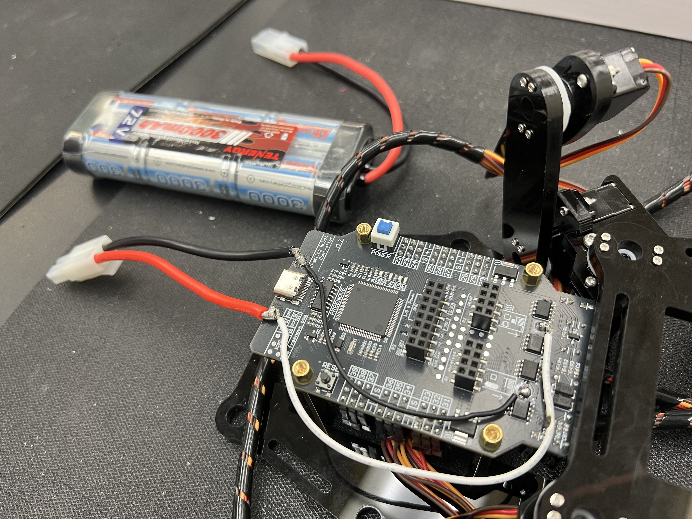{: style="display: block; margin: 0 auto; width: 400px;"}
<div align="center">
  Hexapod control board and sautered wires
</div>

## Fixing the servo motors
Once power was supplied to the robot, it would curl up in unnatural ways after being turned on. I thought that this might have been caused by the robot's power supply due to the use of a differnt battery (mentioned above). However, after checking the power, nothing seemed wrong as to cause the robot to malfunction. After some more investigation in the instruction mannual, I found that I had forgot to zero the motors, and that the curling of the hexapod was caused by the motors trying to go to their default positions. To fix this issue, I disassembled all of the servo motors. After turning the power on, the motors spun to their default position, and I carefully assembled the hexapod back together, being careful not to rotate the servos too much. After testing the robot again, the issue was fixed.

## Next Step
For the next step, I want to build the remote controller and design a battery holder for the external battery pack. This will allow my robot to move remotely while carrying the battery pack.


# Schematics 

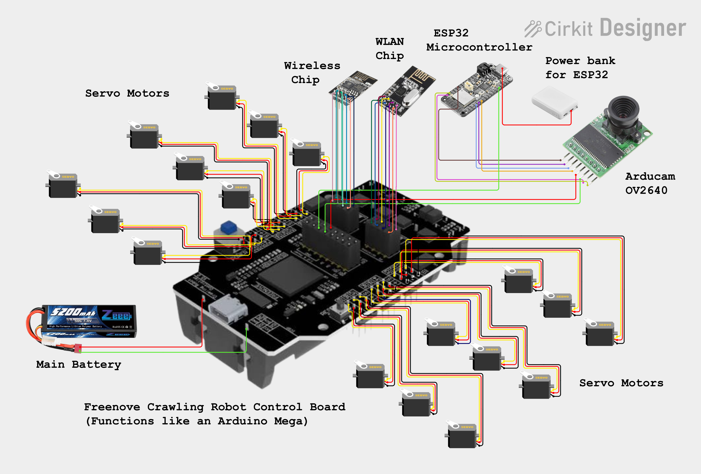{: style="display: block; margin: 0 auto;"} 

# Code
Here's where you'll put your code. The syntax below places it into a block of code. Follow the guide [here]([url](https://www.markdownguide.org/extended-syntax/)) to learn how to customize it to your project needs. 

## Camera Code
```c++
// For default camera function
#include <Wire.h>
#include <ArduCAM.h>
#undef swap //Undefines ArduCAM swap function so it does not conflict with WebServer.h swap function
#include <SPI.h>
#include "memorysaver.h"

// For wireless camera function
#include <WiFi.h>
#include <WebServer.h>

// Set higher for more video fps
const int FREQUENCY = 8000000; // Communication frequency
const int BUFFER_SIZE = 4096;   // Buffer size 

const char* ssid     = "bluestamp_j10";      // Wi-Fi Name
const char* password = "blueblue123"; // Wi-Fi Password


WebServer server(80); // Sets up HTTP server

//Webpage formatting
const char* htmlPage = R"rawliteral(
<!DOCTYPE html>
<html>
<head>
    <title>Feather V2 Camera Stream</title>
    <meta name="viewport" content="width=device-width, initial-scale=1">
    <style>
        body { font-family: Arial, sans-serif; text-align: center; background: #121212; color: #fff; margin: 20px; }
        img { max-width: 95%; height: auto; border: 2px solid #333; border-radius: 8px; transform: rotate(180deg);}
    </style>
</head>
<body>
    <!-- Point the source directly to the stream endpoint -->
    <div></div>
</body>
</html>
)rawliteral";

// Serves the HTML page
void handleRoot() {
  server.send(200, "text/html", htmlPage); //(200 = sucessfully sent, data type, message content)
}


// Check if memorysaver.h is set to OV2640
#if !(defined OV2640_MINI_2MP)
  #error Please select the hardware platform and camera module in the ../libraries/ArduCAM/memorysaver.h file
#endif

// Set chip select pin:
const int CS = 15;

// Creates ArduCAM object (camera type, chip select pin)
#if defined (OV2640_MINI_2MP)
  ArduCAM myCAM( OV2640, CS );
#else
  ArduCAM myCAM( OV5642, CS );
#endif


void setup() {
uint8_t vid, pid;     // Vendor ID and Product ID
uint8_t temp;         // Temporary storage
Wire.begin();         // Initialize I2C
Serial.begin(115200); // Set baud rate
delay(1000);

// Print "startup complete" (for troulbleshooting)
Serial.println(F("ACK CMD ArduCAM Start! END"));

pinMode(CS, OUTPUT);            // Set CS pin as output
digitalWrite(CS, HIGH);         // Deactivates CS pin until setup complete
delay(200);
SPI.begin(SCK, MISO, MOSI, CS); // Initialize SPI
SPI.setFrequency(FREQUENCY);    // Set SCK speed (higher frequency = faster communication)

// Reset the CPLD (clears lingering image data)
myCAM.write_reg(0x07, 0x80);
delay(100);
myCAM.write_reg(0x07, 0x00);
delay(100);

// Test if SPI is working
while(1){
  myCAM.write_reg(ARDUCHIP_TEST1, 0x55);
  temp = myCAM.read_reg(ARDUCHIP_TEST1);
  if (temp != 0x55){
    Serial.println(F("ACK CMD SPI interface Error! END"));
    delay(1000);continue;
  }else{
    Serial.println(F("ACK CMD SPI interface OK. END"));break;
  }
}

// Validates that attatched camera module is and Ov2640 and is compatible 
// Checks vid (Vendor ID) and pid (Product ID)
while(1){
  myCAM.wrSensorReg8_8(0xff, 0x01);
  myCAM.rdSensorReg8_8(OV2640_CHIPID_HIGH, &vid);
  myCAM.rdSensorReg8_8(OV2640_CHIPID_LOW, &pid);
  if ((vid != 0x26 ) && (( pid != 0x41 ) || ( pid != 0x42 ))){
    Serial.println(F("ACK CMD Can't find OV2640 module! END"));
    delay(1000);
    continue;
  }
  else{
    Serial.println(F("ACK CMD OV2640 detected. END"));
    break;
  } 
}

myCAM.set_format(JPEG);                      // Set photo format to JPEG
myCAM.InitCAM();                             // Initializes camera settings and clears leftover camera data
myCAM.OV2640_set_JPEG_size(OV2640_320x240);  // Set photo resolution
delay(1000);

// Clears FIFO (buffer)
myCAM.clear_fifo_flag();


// Prints "Connecting to Wi-Fi..." until connected (for troubleshooting)
Serial.print("Connecting to Wi-Fi");
WiFi.begin(ssid, password);
while (WiFi.status() != WL_CONNECTED) {
  delay(500);
  Serial.print(".");
}
//Prints "Connected" when connected to wifi (for troubleshooting)
Serial.println("\nConnected! IP Address: ");
Serial.println(WiFi.localIP()); //Prints IP adress in serial monitor

// Triggers handleRoot() to send HTML(website formatting) data to website when a request is made
server.on("/", handleRoot);
// Triggers handleCapture(), 
// server.on("/capture", handleCapture);
// Triggers handleStream()
server.on("/stream", handleStream);

server.begin(); // Start server
}


// Continually checks if a request is made, sends data if request detected
void loop() {
  server.handleClient();
  
}


void handleCapture() {
  // Clears old image data
  myCAM.flush_fifo();
  myCAM.clear_fifo_flag();
  // Takes photo and stores it in FIFO (buffer)
  myCAM.start_capture();

  // Pause program until camera finishes capture
  while (!myCAM.get_bit(ARDUCHIP_TRIG, CAP_DONE_MASK));

  // Prints "Capture error" if image is corrupted (for troubleshooting)
  uint32_t length = myCAM.read_fifo_length();
  if (length == 0 || length >= MAX_FIFO_SIZE) {
    server.send(500, "text/plain", "Capture Error");
    return;
  }

  // Allow for direct raw data transmission
  WiFiClient client = server.client();
  // Send image data specifications
  client.print("HTTP/1.1 200 OK\r\n");                        // Tell browser request was processed succesfully
  client.print("Content-Type: image/jpeg\r\n");               // Tell browser image format
  client.print("Content-Length: " + String(length) + "\r\n"); // Tell browser size of file
  client.print("Connection: close\r\n\r\n");                  // Tell browser to to terminate connection 

  myCAM.CS_LOW(); // Activates CS pin

  // Activates burst read mode (Continually sends next byte without needing to be asked for each byte individually)
  myCAM.set_fifo_burst(); 

  uint8_t buffer[BUFFER_SIZE]; // Creates buffer
  size_t buf_idx = 0; // Stores amount of bytes in buffer

  // Decraments length until 0 (until all bytes are sent)
  while (length--) {
    buffer[buf_idx++] = SPI.transfer(0x00); // Sends a dummy byte to send the next byte to buffer

    // Send the buffer to the browser when buffer is full
    if (buf_idx == sizeof(buffer)) {
      client.write(buffer, buf_idx);
      buf_idx = 0; // Sets index to 0 so incoming data overwrites old data in the buffer
    }
  }

  // Send remaining bytes at the end (that do not completely fill buffer) to browser
  if (buf_idx > 0) {
    client.write(buffer, buf_idx);
  }

  myCAM.CS_HIGH(); // Deactivates CS pin
}


void handleStream() {
  // Allow for direct raw data transmission
  WiFiClient client = server.client();
  
  // Tell browser request was processed succesfully
  client.print("HTTP/1.1 200 OK\r\n"); 

  // Tell browser that data will be sent in a continous stream
  client.print("Content-Type: multipart/x-mixed-replace; boundary=mjpegstream\r\n");
  client.print("Connection: keep-alive\r\n\r\n");

  uint8_t buffer[BUFFER_SIZE]; // Creates buffer

  while (client.connected()) {
    // Clears old image data
    myCAM.flush_fifo();
    myCAM.clear_fifo_flag();
   // Takes photo and stores it in FIFO (buffer)
   myCAM.start_capture();

    // Create watchdog 
    unsigned long timeout = millis(); // Check time since connection established
    bool capture_success = true;      // Check if frame capture sucess or time out
    
    // Break loop if more than 1 second without new frame
    while (!myCAM.get_bit(ARDUCHIP_TRIG, CAP_DONE_MASK)) {
      if (millis() - timeout > 1000) { 
        Serial.println("Warning: Camera capture timeout!");
        capture_success = false;
        break; 
      }
    }

    // Resart loop if camera timed out
    if (!capture_success) {
      myCAM.CS_HIGH();
      continue; 
    }

    uint32_t length = myCAM.read_fifo_length();
    if (length == 0 || length >= MAX_FIFO_SIZE) {
      continue;
    }

    client.print("--mjpegstream\r\n");                              // Tell browser that new image frame incoming
    client.print("Content-Type: image/jpeg\r\n");                   // Tell browser image format
    client.print("Content-Length: " + String(length) + "\r\n\r\n"); // Tell browser size of file

    myCAM.CS_LOW(); // Activates CS pin

    // Activates burst read mode (Continually sends next byte without needing to be asked for each byte individually)
    myCAM.set_fifo_burst();

    // Decraments length until 0 (until all bytes are sent)
    size_t buf_idx = 0;
    while (length--) {
      buffer[buf_idx++] = SPI.transfer(0x00);  // Sends a dummy byte to send the next byte to buffer
      
      // Send the buffer to the browser when buffer is full
      if (buf_idx == sizeof(buffer)) {
        if (!client.connected()) break; 
        client.write(buffer, buf_idx);
        buf_idx = 0;  // Sets index to 0 so incoming data overwrites old data in the buffer
      }
    }

    // Send remaining bytes at the end (that do not completely fill buffer) to browser
    if (buf_idx > 0 && client.connected()) {
      client.write(buffer, buf_idx);
    }
    
    myCAM.CS_HIGH(); // Deactivate CS pin
    client.print("\r\n"); // Tell browser image frame ended

    delay(1); 
  }
}
```

# Bill of Materials
| **Part** | **Note** | **Price** | **Link** |
|:--:|:--:|:--:|:--:|
| Hexapod Kit | Base hexapod construction | $102.95 | <a href="https://www.amazon.com/Freenove-Raspberry-Crawling-Detailed-Tutorial/dp/B07FLXFDZ1?th=1"> Link </a> |
| Adafruit Feather V2 | Microcontroller for the camera | $19.95 | <a href="https://www.adafruit.com/product/5400?srsltid=AfmBOop1ICXdfQI1rkXFHPG4oLnxB5XtSnDnWPT32RcghEwRS8RghYuW"> Link </a> |
| Arducam OV2640 | Allows hexapod to take images of its surroundings | $25.99 | <a href="https://www.amazon.com/Arducam-Module-Megapixels-Arduino-Mega2560/dp/B012UXNDOY/ref=sr_1_1?crid=2GCUYGHA50TJP&dib=eyJ2IjoiMSJ9.5dpM3JLxyp15AqYZjr9_bHNdlwVKkC3WKnLCg0odhgSo8smfYYXuAcd5yPgbeXLI5L_oIGVcm8ODUnjDcAGsYboNEgcXFFCoODD6swFR5YJ5NUzkgO6dz17zr5sjUEF0VUvKoQH0CwPCzfN2ZJjNBJ-J7oKDPQ6CYHarX8TOnIKzACe9zs3wUSgHVJ43qMNX5KDU8CSE9wQAJDGbFysW522mNWj24yW8ligieSWCkes.MKVJ0bMdDfYVj4GEcxG0Lduyw022Qm7hTmUxTQ05i5Q&dib_tag=se&keywords=arducam%2B2640&qid=1784821998&sprefix=arducamov%2B2640%2Caps%2C194&sr=8-1&th=1"> Link </a> |
